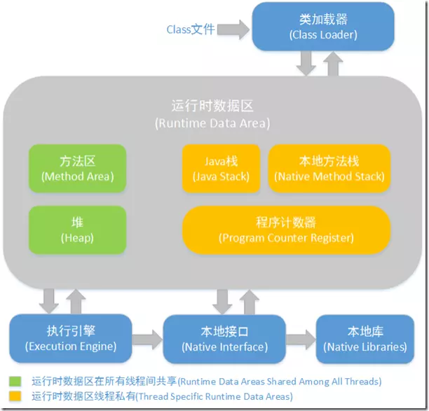
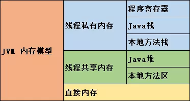
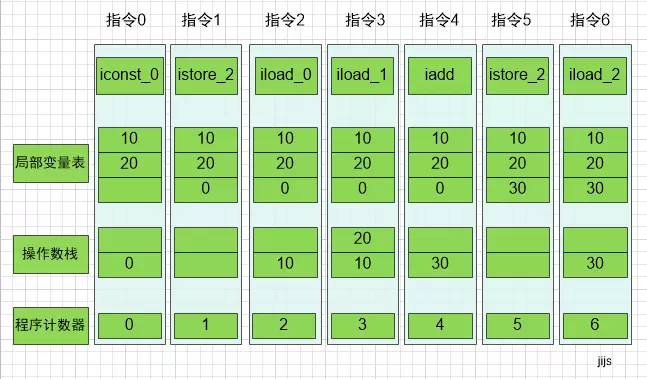
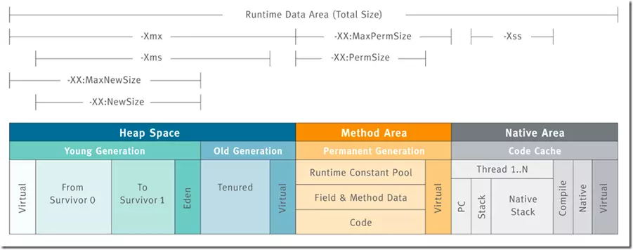
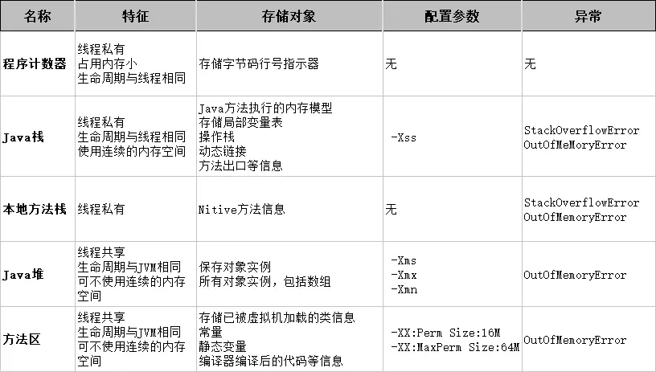

# JVM结构介绍

JVM结存结果如下图所示：




JVM内存模型与上下游


JVM内存模型

类加载器将Class文件读取后，放到运行时数据区，然后执行引擎执行或调用本地接口、本地库。

# 一、JVM内存模型分类

JVM内存模型从线程维度归类分为：**线程私有内存**、**线程共享内存**、以及不在堆内的**直接内 存**。
如下图：




JVM内存模型线程维度分类


## （一）直接内存

> 为什么先讲直接内存？ 因为直接内存更准确的说不在JVM的堆范围内，但JVM会使用到。故此先介绍直接内存。

直接内存并不是JVM运行时数据区的一部分，但也会呗频繁的使用。在JDK 1.4引入的NIO提供了基于Channel与Buffer的IO方式，它可以使用Native函数库直接分配堆外的内存，然后使用DirectByteBuffer对象作为这块内存的引用进行操作，这样旧避免了Java堆和Native堆来回赋值数据，因此在一些场景中可以显著提高性能。
**本机直接内存的分配不会收到Java堆大小的限制**，（即不会遵守-Xms、-Xmx等配置）。但仍然是内存，则肯定还是会收到本机总内存大小+寻址空间的限制，因此扩展时也会出现`OutOfMemoryError`异常。

## （二）线程私有型内存

线程私有型内存 由三种：程序寄存器、Java栈、本地方法栈。
后面会详细讲解..

## （三）线程共享型内存

线程共享型内存 又分为两种：Java堆和本地方法区。
后面会详细讲解..

# 二、程序计数器 

**程序计数器（Program Counter Register）是一块较小的内存空间**，它的作用可以看做是当前线程所执行的字节码的行号指示器。在虚拟机的概念模型里（仅是概念模型，各种虚拟机可能会通过一些更高效的方式去实现），字节码解释器工作时就是通过改变这个计数器的值来选取下一条需要执行的字节码指令，分支、循环、跳转、异常处理、线程恢复等基础功能都需要依赖这个计数器来完成。

由于Java虚拟机的多线程是通过线程轮流切换并分配处理器执行时间的方式来实现的，在任何一个确定的时刻，一个处理器（对于多核处理器来说是一个内核）只会执行一条线程中的指令。因此，为了线程切换后能恢复到正确的执行位置，每条线程都需要有一个独立的程序计数器，各条线程之间的计数器互不影响，独立存储，我们称这类内存区域为`“线程私有”`的内存。

如果线程正在执行的是一个Java方法，这个`计数器记录的是正在执行的虚拟机字节码指令的地址`；如果正在执行的是Natvie方法，这个计数器值则为空（Undefined）。

此内存区域是`唯一`一个在Java虚拟机规范中没有规定任何`OutOfMemoryError`情况的区域。

白话文： 程序计数器 可以从计算机原型中理解，它类似与CPU寄存器；用于记录JVM的各自独立线程的执行指令。当然是线程私有。

# 三、Java栈 

Java栈 - Java Stack 与程序计数器一样，Java虚拟机栈（Java Virtual Machine Stacks）也是`线程私有`的，它的`生命周期与线程相同`。虚拟机栈描述的是Java方法执行的内存模型：每个方法被执行的时候都会同时创建一个`栈帧（Stack Frame）`用于存储`局部变量表、操作栈、动态链接、方法出口`等信息。每一个方法被调用直至执行完成的过程，就对应着一个栈帧在虚拟机栈中从入栈到出栈的过程。

局部变量表存放了编译期可知的各种基本数据类型（boolean、byte、char、short、int、float、long、double）、对象引用（reference类型，它不等同于对象本身，根据不同的虚拟机实现，它可能是一个指向对象起始地址的引用指针，也可能指向一个代表对象的句柄或者其他与此对象相关的位置）和returnAddress类型（指向了一条字节码指令的地址）。

其中**64位长度的long和double类型的数据会占用2个局部变量空间（Slot）**，其余的数据类型只占用1个。局部变量表所需的内存空间在编译期间完成分配，当进入一个方法时，这个方法需要在帧中分配多大的局部变量空间是完全确定的，在方法运行期间不会改变局部变量表的大小。

在Java虚拟机规范中，对这个区域规定了两种异常状况：

- 如果线程请求的栈深度大于虚拟机所允许的深度，将抛出`StackOverflowError`异常；
- 如果虚拟机栈可以动态扩展（当前大部分的Java虚拟机都可动态扩展，只不过Java虚拟机规范中也允许固定长度的虚拟机栈），当扩展时无法申请到足够的内存时会抛出`OutOfMemoryError`异常。

如下图：


Java栈

### （一）局部变量表

局部变量表是一组变量值存储空间，用于存放`方法参数`和`方法内部定义的局部变量`。在Java程序被编译成Class文件时，就在方法的Code属性的max_locals数据项中确定了该方法所需要分配的最大局部变量表的容量。

局部变量表的容量以`变量槽（Slot）`为最小单位，32位虚拟机中一个Slot可以存放一个32位以内的数据类型（boolean、byte、char、short、int、float、reference和returnAddress八种）。

reference类型虚拟机规范没有明确说明它的长度，但一般来说，虚拟机实现至少都应当能从此引用中直接或者间接地查找到对象在Java堆中的起始地址索引和方法区中的对象类型数据。

returnAddress类型是为字节码指令jsr、jsr_w和ret服务的，它指向了一条字节码指令的地址。

虚拟机是使用局部变量表完成参数值到参数变量列表的传递过程的，如果是实例方法（非static），那么局部变量表的`第0位索引`的Slot默认是用于传递方法所属对象实例的引用，在方法中通过`this`访问。

Slot是可以重用的，当Slot中的变量超出了作用域，那么下一次分配Slot的时候，将会覆盖原来的数据。Slot对对象的引用会影响GC（要是被引用，将不会被回收）。
`系统不会为局部变量赋予初始值`（实例变量和类变量都会被赋予初始值）。也就是说不存在类变量那样的准备阶段。

### （二）操作数栈

操作数栈 和局部变量区一样，操作数栈也是被组织成一个以字长为单位的数组。但是和前者不同的是，它不是通过索引来访问，而是`通过标准的栈操作——压栈和出栈—来访问的`。比如，如果某个指令把一个值压入到操作数栈中，稍后另一个指令就可以弹出这个值来使用。

虚拟机在操作数栈中存储数据的方式和在局部变量区中是一样的：如int、long、float、double、reference和returnType的存储。对于byte、short以及char类型的值在压入到操作数栈之前，也会被转换为int。

虚拟机把操作数栈作为它的工作区——大多数指令都要从这里弹出数据，执行运算，然后把结果压回操作数栈。比如，iadd指令就要从操作数栈中弹出两个整数，执行加法运算，其结果又压回到操作数栈中，看看下面的示例，它演示了虚拟机是如何把两个int类型的局部变量相加，再把结果保存到第三个局部变量的：

```cpp
begin
iload_0    // push the int in local variable 0 ontothe stack
iload_1    //push the int in local variable 1 onto the stack
iadd       // pop two ints, add them, push result
istore_2   // pop int, store into local variable 2
end
```

在这个字节码序列里，前两个指令iload_0和iload_1将存储在局部变量中索引为0和1的整数压入操作数栈中，其后iadd指令从操作数栈中弹出那两个整数相加，再将结果压入操作数栈。第四条指令istore_2则从操作数栈中弹出结果，并把它存储到局部变量区索引为2的位置。下图详细表述了这个过程中局部变量和操作数栈的状态变化，图中没有使用的局部变量区和操作数栈区域以空白表示。
如下图：


操作数栈操作流程

### （三）动态链接

动态连接 : `虚拟机运行的时候,运行时常量池会保存大量的符号引用，这些符号引用可以看成是每个方法的间接引用`。如果代表栈帧A的方法想调用代表栈帧B的方法，那么这个虚拟机的方法调用指令就会以B方法的符号引用作为参数，但是因为符号引用并不是直接指向代表B方法的内存位置，所以在调用之前还必须要将符号引用转换为直接引用，然后通过直接引用才可以访问到真正的方法。

- 如果符号引用是在类加载阶段或者第一次使用的时候转化为直接应用，那么这种转换成为**静态解析**。
- 如果是在运行期间转换为直接引用，那么这种转换就成为**动态连接**。

### （四） 返回地址

方法的返回分为两种情况：

- 一种是正常退出，退出后会根据方法的定义来决定是否要传返回值给上层的调用者。
- 一种是异常导致的方法结束，这种情况是不会传返回值给上层的调用方法。

```
不过无论是那种方式的方法结束，在退出当前方法时都会跳转到当前方法被调用的位置。
```

- 如果方法是正常退出的，则`调用者的PC计数器的值就可以作为返回地址`；
- 如果是因为异常退出的，则是`需要通过异常处理表来确定`。

方法的的一次调用就对应着栈帧在虚拟机栈中的一次入栈出栈操作，因此方法退出时可能做的事情包括：恢复上层方法的局部变量表以及操作数栈，如果有返回值的话，就把返回值压入到调用者栈帧的操作数栈中，还会把PC计数器的值调整为方法调用入口的下一条指令。

关于Java栈的更多解析，请查阅下文，我觉得写的很好。
<https://www.jianshu.com/p/15932712fcb4>
这张图很有故事...




局部变量表和操作数栈关系


# 四、本地方法栈

本地方法栈（Native MethodStacks）与虚拟机栈所发挥的作用是非常相似的，其区别不过是虚拟机栈为虚拟机执行Java 方法（也就是字节码）服务，而`本地方法栈则是为虚拟机使用到的Native 方法服务`。本地方法栈也是```线程私有``的。虚拟机规范中对本地方法栈中的方法使用的语言、使用方式与数据结构并没有强制规定，因此具体的虚拟机可以自由实现它。甚至有的虚拟机（譬如Sun HotSpot 虚拟机）直接就把本地方法栈和虚拟机栈合二为一。

与虚拟机栈一样，本地方法栈区域也会抛出`StackOverflowError`和`OutOfMemoryError`异常。

# 五、方法区

方法区在一个JVM 实例的内部，类型信息被存储在一个称为方法区的内存逻辑区中。类型信息是由类加载器在类加载时从类文件中提取出来的。类(静态)变量也存储在方法区中。

简单说方法区用来存储类型的元数据信息，一个.class文件是类被java虚拟机使用之前的表现形式，一旦这个类要被使用，`java虚拟机就会对其进行装载、连接（验证、准备、解析）和初始化`，而装载后的结果就是由.class文件转变为方法区中的一段特定的数据结构。

#### ① 方法区数据结构

这个数据结构会存储如下信息：

- 类型信息：全限定名、直接超类的全限定名、类的类型还是接口类型、访问修饰符、直接超接口的全限定名的有序列表
- 字段信息：字段名、字段类型、字段的修饰符
- 方法信息：方法名、方法返回类型、方法参数的数量和类型（按照顺序）、方法的修饰符
- 其他信息：除了常量以外的所有类（静态）变量、`一个指向ClassLoader的指针`、`一个指向Class对象的指针`、`常量池`（常量数据以及对其他类型的符号引用）

关于JVM中 常量池的解释，这篇文章解析的比较好。
<https://my.oschina.net/u/867830/blog/1609952>
<https://www.cnblogs.com/iyangyuan/p/4631696.html>


常量池


#### ② 方法区的特点

方法区主要有以下几个特点：

- 1.`方法区是线程安全的`，由于所有的线程都共享方法区，所以方法区里的数据访问必须被设计成线程安全的。
- 2、`方法区的大小不必是固定的`，JVM可根据应用需要动态调整。
- 3、`方法区也可被垃圾收集`，当某个类不在被使用(不可触及)时，JVM将卸载这个类，进行垃圾收集。

HotSpot 虚拟机，很多人愿意把方法区称为“永久代”（Permanent Generation）。本质上两者并不等价，仅仅是因为HotSpot 虚拟机的设计团队选择把GC 分代收集扩展至方法区，或者说使用永久代来实现方法区而已。对于其他虚拟机来说是不存在永久代的概念的。
`当方法区无法满足内存分配需求时，将抛出OutOfMemoryError异常。`

#### ③ 方法区内存大小设置：

###### jdk6，jdk7 永久区

```undefined
-XX:PermSize=10M 初始化方法区大小为10M。
-XX:MaxPermSize 方法区最大内存为10M。
-XX:PrintGCDetails 打印日志详情。
```

###### jdk8 元数据区

```undefined
-XX:MetaspaceSize=10M
-XX:MaxMetaspaceSize=10M
```

需要注意一点：
jdk8中永久区被移除了，取而代之的是元数据区，可能方法区依赖jvm的内存吧。
不同的是元数据区是堆外直接内存，与方法永久区不同，在不指定大小的情况下，虚拟机会耗尽所有可用的系统内存。
元数据区发生溢出，虚拟机一样抛出异常，如下：`java.lang.OutOfMemoryError Metaspace`

# 六、Java 堆

终于说到今天的大主角了 Java堆 Heap。

## （一）Java堆

对于大多数应用来说，Java堆（Java Heap）是Java虚拟机所管理的内存中最大的一块。Java堆是被所有`线程共享`的一块内存区域，在虚拟机启动时创建。此内存区域的唯一目的就是存放对象实例，几乎所有的对象实例都在这里分配内存。

Java堆是垃圾收集器管理的主要区域，因此很多时候也被称做“GC堆”。如果从内存回收的角度看，由于现在收集器基本都是采用的分代收集算法，所以Java堆中还可以细分为：新生代和老年代；再细致一点的有Eden空间、From Survivor空间、To Survivor空间等。

根据Java虚拟机规范的规定，Java堆可以处于物理上不连续的内存空间中，只要逻辑上是连续的即可，就像我们的磁盘空间一样。在实现时，既可以实现成固定大小的，也可以是可扩展的，不过当前主流的虚拟机都是按照可扩展来实现的（通过-Xmx和-Xms控制）。

```
如果在堆中没有内存完成实例分配，并且堆也无法再扩展时，将会抛出OutOfMemoryError异常。
```

`堆大小 = 新生代 + 老年代`。其中，堆的大小可以通过参数 –Xms、-Xmx 来指定。

默认的，`新生代 ( Young ) 与老年代 ( Old ) 的比例的值为 1:2`( 该值可以通过参数 `–XX:NewRatio`来指定 )，
即：新生代 ( Young ) = 1/3 的堆空间大小。老年代 ( Old ) = 2/3 的堆空间大小。

## （二） 新生代

`程序新创建的对象都是从新生代分配内存`，新生代由Eden Space和两块相同大小的Survivor Space(通常又称S0和S1或From和To)构成。
可通过`-Xmn`参数来指定新生代的大小；也可以通过`-XX:SurvivorRation`来调整Eden Space及SurvivorSpace的大小。

- 1、新生代的初始值NewSize默认为1M，最大值需要设置，可以通过参数`-XX:NewSize`和`-XX:MaxNewSize`或`-Xmn`进行设置；
- 2、为老年代与新生代的大小比值，默认为2：1；
- 3、SurvivorRatio为新生代中Eden和Survivor的大小比值，默认为8：1
  `Edem : from : to = 8 :1 : 1`
  可以通过参数-XX:SurvivorRatio 来设定 )，即： Eden = 8/10 的新生代空间大小，from = to = 1/10 的新生代空间大小。

JVM 每次只会使用 Eden 和其中的一块 Survivor 区域来为对象服务，所以无论什么时候，总是有一块Survivor 区域是空闲着的。

新生代实际可用的内存空间为 9/10 ( 即90% )的新生代空间。

#### Edan区 、From区 - Surivivor 0 、To 区 - Surivivor 1

- 1. `在未开始GC的时候，对象只会存在于Eden区和名为“From”的Survivor区，Survivor区“To”是空的。`
- 1. 紧接着进行GC，Eden区中所有存活的对象都会被复制到“To”，而在“From”区中，仍存活的对象会根据他们的年龄值来决定去向。
- 1. 年龄达到一定值(年龄阈值，可以通过-XX:MaxTenuringThreshold来设置)的对象会被移动到年老代中，没有达到阈值的对象会被复制到“To”区域。经过这次GC后，Eden区和From区已经被清空。
- 1. 这个时候，“From”和“To”会交换他们的角色，也就是新的“To”就是上次GC前的“From”，新的“From”就是上次GC前的“To”。不管怎样，都会保证名为To的Survivor区域是空的。
- 1. Minor GC会一直重复这样的过程，直到“To”区被填满，“To”区被填满之后，会将所有对象移动到年老代中。

###### Minor GC、FullGC

堆是GC收集垃圾的主要区域。`GC 分为两种：Minor GC、FullGC ( 或称为 Major GC )`。

- `Minor GC 是发生在新生代中的垃圾收集动作，所采用的是复制算法。`
  - 当对象在 Eden ( 包括一个 Survivor 区域，这里假设是 from 区域 ) 出生后，
  - 在经过一次 Minor GC 后，如果对象还存活，并且能够被另外一块 Survivor 区域所容纳( 上面已经假设为 from 区域，这里应为 to 区域，即 to 区域有足够的内存空间来存储 Eden 和 from 区域中存活的对象 )，
  - 则使用复制算法将这些仍然还存活的对象复制到另外一块 Survivor 区域 ( 即 to 区域 ) 中，
  - 然后清理所使用过的 Eden 以及 Survivor 区域 ( 即from 区域 )，并且将这些对象的年龄设置为1，以后对象在 Survivor 区每熬过一次 Minor GC，就将对象的年龄 + 1，
  - 当对象的年龄达到某个值时 ( 默认是 15 岁)，这些对象就会成为老年代。
  - 但这也不是一定的，对于一些较大的对象 ( 即需要分配一块较大的连续内存空间 ) 则是直接进入到老年代。
- `Full GC 是发生在老年代的垃圾收集动作，所采用的是标记-清除算法。`
  Full GC 发生的次数不会有 Minor GC 那么频繁，并且做一次 Full GC 要比进行一次 Minor GC 的时间更长。
  标记-清除算法收集垃圾的时候会产生许多的内存碎片 ( 即不连续的内存空间 )，此后需要为较大的对象分配内存空间时，若无法找到足够的连续的内存空间，就会提前触发一次 GC 的收集动作。

## （三） 老生代

用于`存放经过多次新生代GC仍然存活的对象`，例如缓存对象，新建的对象也有可能直接进入老年代，主要有两种情况：

- 1、大对象，可通过启动参数设置`-XX:PretenureSizeThreshold=1024(单位为字节，默认为0)`来代表超过多大时就不在新生代分配，而是直接在老年代分配。
- 2、大的数组对象，且数组中无引用外部对象。

老年代所占的内存大小为-Xmx对应的值减去-Xmn对应的值。
如果在堆中没有内存完成实例分配，并且堆也无法再扩展时，将会抛出`OutOfMemoryError`异常。

# 七、JVM各空间分配




各空间分配参数

- Java堆 ：
  - -Xms 初始堆大小
  - -Xmx 最大堆大小
  - -XX:NewSize 初始新生代大小
  - -XX:MaxNewSize 最大新生代大小
- 方法区 Method Area
  - -XX:PermSize 初始方法区大小
  - -XX:MaxPermSize 最大方法区大小
- Java栈 ： -Xss 每个线程栈的大小

# 最后，小结




### 参考

<http://www.ityouknow.com/jvm/2017/08/29/GC-garbage-collection.html>
<https://blog.csdn.net/u012799221/article/details/73180509>
<https://www.jianshu.com/p/fd1d4f21733a>
<https://blog.csdn.net/zjf280441589/article/details/53437703>
《[深入理解Java虚拟机](https://book.douban.com/subject/24722612/)》
<https://www.cnblogs.com/E-star/p/5556188.html>
<https://www.cnblogs.com/SaraMoring/p/5713732.html>
<https://blog.csdn.net/SunshineLPL/article/details/78318709?locationNum=9&fps=1>
<https://blog.csdn.net/u012152619/article/details/46968883>
<https://www.cnblogs.com/bude/p/6304512.html>