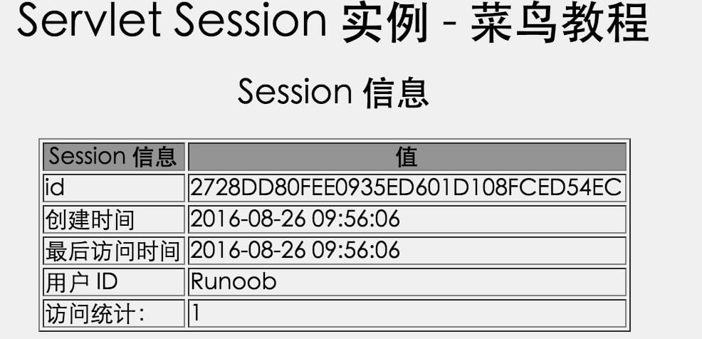
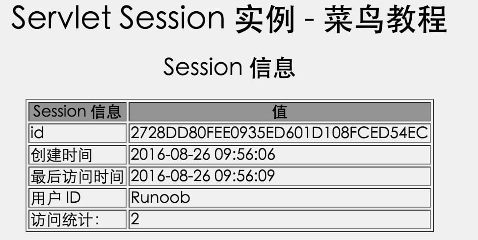

# Servlet Session 跟踪

HTTP 是一种"无状态"协议，这意味着每次客户端检索网页时，客户端打开一个单独的连接到 Web 服务器，服务器会自动不保留之前客户端请求的任何记录。

但是仍然有以下三种方式来维持 Web 客户端和 Web 服务器之间的 session 会话：

## Cookies

一个 Web 服务器可以分配一个唯一的 session 会话 ID 作为每个 Web 客户端的 cookie，对于客户端的后续请求可以使用接收到的 cookie 来识别。

这可能不是一个有效的方法，因为很多浏览器不支持 cookie，所以我们建议不要使用这种方式来维持 session 会话。

## 隐藏的表单字段

一个 Web 服务器可以发送一个隐藏的 HTML 表单字段，以及一个唯一的 session 会话 ID，如下所示：

```
<input type="hidden" name="sessionid" value="12345">
```

该条目意味着，当表单被提交时，指定的名称和值会被自动包含在 GET 或 POST 数据中。每次当 Web 浏览器发送回请求时，session_id 值可以用于保持不同的 Web 浏览器的跟踪。

这可能是一种保持 session 会话跟踪的有效方式，但是点击常规的超文本链接（<A HREF...>）不会导致表单提交，因此隐藏的表单字段也不支持常规的 session 会话跟踪。

## URL 重写

您可以在每个 URL 末尾追加一些额外的数据来标识 session 会话，服务器会把该 session 会话标识符与已存储的有关 session 会话的数据相关联。

例如，http://w3cschool.cc/file.htm;sessionid=12345，session 会话标识符被附加为 sessionid=12345，标识符可被 Web 服务器访问以识别客户端。

URL 重写是一种更好的维持 session 会话的方式，它在浏览器不支持 cookie 时能够很好地工作，但是它的缺点是会动态生成每个 URL 来为页面分配一个 session 会话 ID，即使是在很简单的静态 HTML 页面中也会如此。

## HttpSession 对象

除了上述的三种方式，Servlet 还提供了 HttpSession 接口，该接口提供了一种跨多个页面请求或访问网站时识别用户以及存储有关用户信息的方式。

Servlet 容器使用这个接口来创建一个 HTTP 客户端和 HTTP 服务器之间的 session 会话。会话持续一个指定的时间段，跨多个连接或页面请求。

您会通过调用 HttpServletRequest 的公共方法 **getSession()** 来获取 HttpSession 对象，如下所示：

```
HttpSession session = request.getSession();
```

你需要在向客户端发送任何文档内容之前调用 *request.getSession()*。下面总结了 HttpSession 对象中可用的几个重要的方法：

| 序号 | 方法 & 描述                                                  |
| ---- | ------------------------------------------------------------ |
| 1    | **public Object getAttribute(String name)** 该方法返回在该 session 会话中具有指定名称的对象，如果没有指定名称的对象，则返回 null。 |
| 2    | **public Enumeration getAttributeNames()** 该方法返回 String 对象的枚举，String 对象包含所有绑定到该 session 会话的对象的名称。 |
| 3    | **public long getCreationTime()** 该方法返回该 session 会话被创建的时间，自格林尼治标准时间 1970 年 1 月 1 日午夜算起，以毫秒为单位。 |
| 4    | **public String getId()** 该方法返回一个包含分配给该 session 会话的唯一标识符的字符串。 |
| 5    | **public long getLastAccessedTime()** 该方法返回客户端最后一次发送与该 session 会话相关的请求的时间自格林尼治标准时间 1970 年 1 月 1 日午夜算起，以毫秒为单位。 |
| 6    | **public int getMaxInactiveInterval()** 该方法返回 Servlet 容器在客户端访问时保持 session 会话打开的最大时间间隔，以秒为单位。 |
| 7    | **public void invalidate()** 该方法指示该 session 会话无效，并解除绑定到它上面的任何对象。 |
| 8    | **public boolean isNew()** 如果客户端还不知道该 session 会话，或者如果客户选择不参入该 session 会话，则该方法返回 true。 |
| 9    | **public void removeAttribute(String name)** 该方法将从该 session 会话移除指定名称的对象。 |
| 10   | **public void setAttribute(String name, Object value)**  该方法使用指定的名称绑定一个对象到该 session 会话。 |
| 11   | **public void setMaxInactiveInterval(int interval)** 该方法在 Servlet 容器指示该 session 会话无效之前，指定客户端请求之间的时间，以秒为单位。 |


## Session 跟踪实例

本实例说明了如何使用 HttpSession 对象获取 session 会话创建时间和最后访问时间。如果不存在 session 会话，我们将通过请求创建一个新的 session 会话。

```java
package com.runoob.test;

import java.io.IOException;
import java.io.PrintWriter;
import java.text.SimpleDateFormat;
import java.util.Date;

import javax.servlet.ServletException;
import javax.servlet.annotation.WebServlet;
import javax.servlet.http.HttpServlet;
import javax.servlet.http.HttpServletRequest;
import javax.servlet.http.HttpServletResponse;
import javax.servlet.http.HttpSession;

/**
 * Servlet implementation class SessionTrack
 */
@WebServlet("/SessionTrack")
public class SessionTrack extends HttpServlet {
    private static final long serialVersionUID = 1L;

    public void doGet(HttpServletRequest request, HttpServletResponse response) throws ServletException, IOException
    {
        // 如果不存在 session 会话，则创建一个 session 对象
        HttpSession session = request.getSession(true);
        // 获取 session 创建时间
        Date createTime = new Date(session.getCreationTime());
        // 获取该网页的最后一次访问时间
        Date lastAccessTime = new Date(session.getLastAccessedTime());
         
        //设置日期输出的格式  
        SimpleDateFormat df=new SimpleDateFormat("yyyy-MM-dd HH:mm:ss");  
    
        String title = "Servlet Session 实例 - 菜鸟教程";
        Integer visitCount = new Integer(0);
        String visitCountKey = new String("visitCount");
        String userIDKey = new String("userID");
        String userID = new String("Runoob");
        if(session.getAttribute(visitCountKey) == null) {
            session.setAttribute(visitCountKey, new Integer(0));
        }

    
        // 检查网页上是否有新的访问者
        if (session.isNew()){
            title = "Servlet Session 实例 - 菜鸟教程";
             session.setAttribute(userIDKey, userID);
        } else {
             visitCount = (Integer)session.getAttribute(visitCountKey);
             visitCount = visitCount + 1;
             userID = (String)session.getAttribute(userIDKey);
        }
        session.setAttribute(visitCountKey,  visitCount);
    
        // 设置响应内容类型
        response.setContentType("text/html;charset=UTF-8");
        PrintWriter out = response.getWriter();
    
        String docType = "<!DOCTYPE html>\n";
        out.println(docType +
                "<html>\n" +
                "<head><title>" + title + "</title></head>\n" +
                "<body bgcolor=\"#f0f0f0\">\n" +
                "<h1 align=\"center\">" + title + "</h1>\n" +
                 "<h2 align=\"center\">Session 信息</h2>\n" +
                "<table border=\"1\" align=\"center\">\n" +
                "<tr bgcolor=\"#949494\">\n" +
                "  <th>Session 信息</th><th>值</th></tr>\n" +
                "<tr>\n" +
                "  <td>id</td>\n" +
                "  <td>" + session.getId() + "</td></tr>\n" +
                "<tr>\n" +
                "  <td>创建时间</td>\n" +
                "  <td>" +  df.format(createTime) + 
                "  </td></tr>\n" +
                "<tr>\n" +
                "  <td>最后访问时间</td>\n" +
                "  <td>" + df.format(lastAccessTime) + 
                "  </td></tr>\n" +
                "<tr>\n" +
                "  <td>用户 ID</td>\n" +
                "  <td>" + userID + 
                "  </td></tr>\n" +
                "<tr>\n" +
                "  <td>访问统计：</td>\n" +
                "  <td>" + visitCount + "</td></tr>\n" +
                "</table>\n" +
                "</body></html>"); 
    }
}
```

编译上面的 Servlet **SessionTrack**，并在 web.xml 文件中创建适当的条目。

```
<?xml version="1.0" encoding="UTF-8"?>
<web-app>
  <servlet> 
    <!-- 类名 -->  
    <servlet-name>SessionTrack</servlet-name>
    <!-- 所在的包 -->
    <servlet-class>com.runoob.test.SessionTrack</servlet-class>
  </servlet>
  <servlet-mapping>
    <servlet-name>SessionTrack</servlet-name>
    <!-- 访问的网址 -->
    <url-pattern>/TomcatTest/SessionTrack</url-pattern>
  </servlet-mapping>
</web-app>
```

在浏览器地址栏输入 *http://localhost:8080/TomcatTest/SessionTrack*，当您第一次运行时将显示如下结果：



再次尝试运行相同的 Servlet，它将显示如下结果：




## 删除 Session 会话数据

当您完成了一个用户的 session 会话数据，您有以下几种选择：

- **移除一个特定的属性：**您可以调用 *public void removeAttribute(String name)* 方法来删除与特定的键相关联的值。
- **删除整个 session 会话：**您可以调用 *public void invalidate()* 方法来丢弃整个 session 会话。
- **设置 session 会话过期时间：**您可以调用 *public void setMaxInactiveInterval(int interval)* 方法来单独设置 session 会话超时。
- **注销用户：**如果使用的是支持 servlet 2.4 的服务器，您可以调用 **logout** 来注销 Web 服务器的客户端，并把属于所有用户的所有 session 会话设置为无效。
- **web.xml 配置：**如果您使用的是 Tomcat，除了上述方法，您还可以在 web.xml 文件中配置 session 会话超时，如下所示：

```
  <session-config>
    <session-timeout>15</session-timeout>
  </session-config>
```

上面实例中的超时时间是以分钟为单位，将覆盖 Tomcat 中默认的 30 分钟超时时间。

在一个 Servlet 中的 getMaxInactiveInterval() 方法会返回 session  会话的超时时间，以秒为单位。所以，如果在 web.xml 中配置 session 会话超时时间为 15 分钟，那么  getMaxInactiveInterval() 会返回 900。