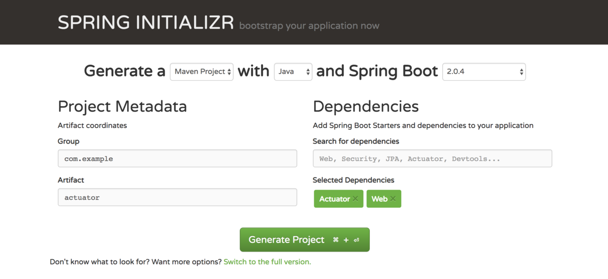

# Spring actuator 监控调试程序

Spring Boot Actuator可以帮助你监控和管理Spring Boot应用，比如健康检查、审计、统计和HTTP追踪等。所有的这些特性可以通过JMX或者HTTP endpoints来获得。

Actuator同时还可以与外部应用监控系统整合，比如 [Prometheus](https://prometheus.io/), [Graphite](https://graphiteapp.org/), [DataDog](https://www.datadoghq.com/), [Influx](https://www.influxdata.com/), [Wavefront](https://www.wavefront.com/), [New Relic](https://newrelic.com/)等。这些系统提供了非常好的仪表盘、图标、分析和告警等功能，使得你可以通过统一的接口轻松的监控和管理你的应用。

Actuator使用[Micrometer](http://micrometer.io/)来整合上面提到的外部应用监控系统。这使得只要通过非常小的配置就可以集成任何应用监控系统。

我将把Spring Boot Actuator教程分为两部分：

- 第一部分(本文)教你如何配置Actuator和通过Http endpoints来进入这些特征。
- 第二部分教你如何整合Actuator和外部应用监控系统。

## 创建一个有Actuator的Spring Boot工程

首先让我们建一个依赖acutator的简单应用。

你可以使用[Spring Boot CLI](https://docs.spring.io/spring-boot/docs/current/reference/htmlsingle/#getting-started-installing-the-cli)创建应用：

```shell
spring init -d=web,actuator -n=actuator actuator
```

或者，你可以使用[Spring Initializr](http://start.spring.io/)网站来创建应用：




Spring initialzr.png

## 增加Spring Boot Actuator到一个存在的应用

你可以增加`spring-boot-actuator`模块到一个已经存在的应用，通过使用下面的依赖。

```xml
<dependencies>
    <dependency>
        <groupId>org.springframework.boot</groupId>
        <artifactId>spring-boot-starter-actuator</artifactId>
    </dependency>
</dependencies>
```

对于Gradle，依赖如下：


```groovy
dependencies {
    compile("org.springframework.boot:spring-boot-starter-actuator")
}
```

## 使用Actuator Endpoints来监控应用

Actuator创建了所谓的**endpoint**来暴露HTTP或者JMX来监控和管理应用。

举个例子，有一个叫`/health`的endpoint，提供了关于应用健康的基础信息。`/metrics`endpoints展示了几个有用的度量信息，比如JVM内存使用情况、系统CPU使用情况、打开的文件等等。`/loggers`endpoint展示了应用的日志和可以让你在运行时改变日志等级。

**值得注意的是，每一给actuator endpoint可以被显式的打开和关闭。此外，这些endpoints也需要通过HTTP或者JMX暴露出来，使得它们能被远程进入。**

让我们运行应用并且尝试进入默认通过HTTP暴露的打开状态的actuator endpoints。之后，我们将学习如何打开更多的endpoints并且通过HTTP暴露它们。

在应用的根目录下打开命令行工具运行以下命令：

```shell
mvn spring-boot:run
```

应用默认使用`8080`端口运行。一旦这个应用启动了，你可以通过<http://localhost:8080/actuator>来展示所有通过HTTP暴露的endpoints。


```json
{"_links":{"self":{"href":"http://localhost:8080/actuator","templated":false},"health":{"href":"http://localhost:8080/actuator/health","templated":false},"info":{"href":"http://localhost:8080/actuator/info","templated":false}}}
```

打开<http://localhost:8080/actuator/health>，则会显示如下内容:


```json
{"status":"UP"}
```

状态将是`UP`只要应用是健康的。如果应用不健康将会显示`DOWN`,比如与仪表盘的连接异常或者缺水磁盘空间等。下一节我们将学习spring boot如何决定应用的健康和如何修复这些健康问题。

`info`endpoint(<http://localhost:8080/actuator/info>)展示了关于应用的一般信息，这些信息从编译文件比如`META-INF/build-info.properties`或者Git文件比如`git.properties`或者任何环境的property中获取。你将在下一节中学习如何改变这个endpoint的输出。

**默认，只有health和info通过HTTP暴露了出来**。这也是为什么`/actuator`页面只展示了`health`和`info`endpoints。我们将学习如何暴露其他的endpoint。首先，让我们看看其他的endpoints是什么。

以下是一些非常有用的actuator endpoints列表。你可以在[official documentation](https://docs.spring.io/spring-boot/docs/current/reference/html/production-ready-endpoints.html)上面看到完整的列表。

| ID               | Description                                                  | Enabled by default |
| ---------------- | ------------------------------------------------------------ | :----------------: |
| auditevents      | 显示当前应用程序的审计事件信息                               |        Yes         |
| beans            | 显示应用上下文中创建的所有Bean                               |        Yes         |
| caches           | 获取缓存信息                                                 |        Yes         |
| conditions       | 显示配置类和自动配置类(configuration and auto-configuration classes) 的状态及它们被应用或未被应用的原因 |        Yes         |
| configprops      | 该端点用来获取应用中配置的属性信息报告 （所有@ConfigurationProperties的集合列表） |        Yes         |
| env              | 获取应用所有可用的环境属性报告。包括： 环境变量、JVM属性、应用的配置配置、命令行中的参数 |        Yes         |
| flyway           | 显示数据库迁移路径（如果有）                                 |        Yes         |
| health           | 显示应用的健康信息                                           |        Yes         |
| httptrace        | 返回基本的HTTP跟踪信息。 (默认最多100 HTTP request-response exchanges). |        Yes         |
| info             | 返回一些应用自定义的信息，我们可以在application.properties 配置文件中通过info前缀来设置这些属性：info.app.name=spring-boot-hello |        Yes         |
| integrationgraph | Shows the Spring Integration graph.                          |        Yes         |
| loggers          | Shows and modifies the configuration of loggers in the application. |        Yes         |
| liquibase        | Shows any Liquibase database migrations that have been applied. |        Yes         |
| metrics          | 返回当前应用的各类重要度量指标，比如：内存信息、线程信息、垃圾回收信息等 |        Yes         |
| mappings         | 返回所有Spring MVC的控制器映射关系报告 （所有@RequestMapping路径的集合列表） |        Yes         |
| scheduledtasks   | 显示应用程序中的计划任务                                     |        Yes         |
| sessions         | 允许从Spring会话支持的会话存储中检索和删除(retrieval and deletion) 用户会话。使用Spring Session对反应性Web应用程序的支持时不可用 |        Yes         |
| shutdown         | 允许应用以优雅的方式关闭（默认情况下不启用）                 |         No         |
| threaddump       | 执行一个线程dump                                             |        Yes         |

## 打开和关闭Actuator Endpoints

默认，上述所有的endpints都是打开的，除了`shutdown` endpoint。

你可以通过设置`management.endpoint.<id>.enabled to true or false`(`id`是endpoint的id)来决定打开还是关闭一个actuator endpoint。

举个例子，要想打开`shutdown` endpoint，增加以下内容在你的`application.properties`文件中：

```xml
management.endpoint.shutdown.enabled=true
```

## 暴露Actuator Endpoints

默认，actuator endpoint通过JMX被暴露，而通过HTTP暴露的只有`health`和`info`。

以下是你可以通过应用的properties可以通过HTTP和JMX暴露的actuator endpoint。

- 通过HTTP暴露Actuator endpoints。

```xml
# Use "*" to expose all endpoints, or a comma-separated list to expose selected ones
management.endpoints.web.exposure.include=health,info 
management.endpoints.web.exposure.exclude=
```

 通过JMX暴露Actuator endpoints。

```xml
# Use "*" to expose all endpoints, or a comma-separated list to expose selected ones
management.endpoints.jmx.exposure.include=*
management.endpoints.jmx.exposure.exclude=
```

-  

通过设置`management.endpoints.web.exposure.include`为`*`，我们可以在<http://localhost:8080/actuator>页面看到如下内容。

```json
{"_links":{"self":{"href":"http://localhost:8080/actuator","templated":false},"auditevents":{"href":"http://localhost:8080/actuator/auditevents","templated":false},"beans":{"href":"http://localhost:8080/actuator/beans","templated":false},"health":{"href":"http://localhost:8080/actuator/health","templated":false},"conditions":{"href":"http://localhost:8080/actuator/conditions","templated":false},"configprops":{"href":"http://localhost:8080/actuator/configprops","templated":false},"env":{"href":"http://localhost:8080/actuator/env","templated":false},"env-toMatch":{"href":"http://localhost:8080/actuator/env/{toMatch}","templated":true},"info":{"href":"http://localhost:8080/actuator/info","templated":false},"loggers":{"href":"http://localhost:8080/actuator/loggers","templated":false},"loggers-name":{"href":"http://localhost:8080/actuator/loggers/{name}","templated":true},"heapdump":{"href":"http://localhost:8080/actuator/heapdump","templated":false},"threaddump":{"href":"http://localhost:8080/actuator/threaddump","templated":false},"prometheus":{"href":"http://localhost:8080/actuator/prometheus","templated":false},"metrics-requiredMetricName":{"href":"http://localhost:8080/actuator/metrics/{requiredMetricName}","templated":true},"metrics":{"href":"http://localhost:8080/actuator/metrics","templated":false},"scheduledtasks":{"href":"http://localhost:8080/actuator/scheduledtasks","templated":false},"httptrace":{"href":"http://localhost:8080/actuator/httptrace","templated":false},"mappings":{"href":"http://localhost:8080/actuator/mappings","templated":false}}}
```

## 解析常用的actuator endpoint

### /health endpoint

`health` endpoint通过合并几个健康指数检查应用的健康情况。

Spring Boot Actuator有几个预定义的健康指标比如[`DataSourceHealthIndicator`](https://docs.spring.io/spring-boot/docs/current/api/org/springframework/boot/actuate/jdbc/DataSourceHealthIndicator.html), [`DiskSpaceHealthIndicator`](https://docs.spring.io/spring-boot/docs/current/api/org/springframework/boot/actuate/system/DiskSpaceHealthIndicator.html), [`MongoHealthIndicator`](https://docs.spring.io/spring-boot/docs/current/api/org/springframework/boot/actuate/mongo/MongoHealthIndicator.html), [`RedisHealthIndicator`](https://docs.spring.io/spring-boot/docs/current/api/org/springframework/boot/actuate/redis/RedisHealthIndicator.html), [`CassandraHealthIndicator`](https://docs.spring.io/spring-boot/docs/current/api/org/springframework/boot/actuate/cassandra/CassandraHealthIndicator.html)等。它使用这些健康指标作为健康检查的一部分。

举个例子，如果你的应用使用`Redis`，`RedisHealthindicator`将被当作检查的一部分。如果使用`MongoDB`，那么`MongoHealthIndicator`将被当作检查的一部分。

你也可以关闭特定的健康检查指标，比如在prpperties中使用如下命令：

```xml
management.health.mongo.enabled=false
```

默认，所有的这些健康指标被当作健康检查的一部分。

#### 显示详细的健康信息

`health` endpoint只展示了简单的`UP`和`DOWN`状态。为了获得健康检查中所有指标的详细信息，你可以通过在`application.yaml`中增加如下内容：

```xml
management:
  endpoint:
    health:
      show-details: always
```

一旦你打开上述开关，你在`/health`中可以看到如下详细内容：


```json
{"status":"UP","details":{"diskSpace":{"status":"UP","details":{"total":250790436864,"free":27172782080,"threshold":10485760}}}}
```

`health` endpoint现在包含了`DiskSpaceHealthIndicator`。

如果你的应用包含database(比如MySQL)，`health` endpoint将显示如下内容：

```json
{
   "status":"UP",
   "details":{
      "db":{
         "status":"UP",
         "details":{
            "database":"MySQL",
            "hello":1
         }
      },
      "diskSpace":{
         "status":"UP",
         "details":{
            "total":250790436864,
            "free":100330897408,
            "threshold":10485760
         }
      }
   }
}
```

如果你的MySQL server没有启起来，状态将会变成`DOWN`：

```json
{
   "status":"DOWN",
   "details":{
      "db":{
         "status":"DOWN",
         "details":{
            "error":"org.springframework.jdbc.CannotGetJdbcConnectionException: Failed to obtain JDBC Connection; nested exception is java.sql.SQLTransientConnectionException: HikariPool-1 - Connection is not available, request timed out after 30006ms."
         }
      },
      "diskSpace":{
         "status":"UP",
         "details":{
            "total":250790436864,
            "free":100324585472,
            "threshold":10485760
         }
      }
   }
}
```

#### 创建一个自定义的健康指标

你可以通过实现`HealthIndicator`接口来自定义一个健康指标，或者继承`AbstractHealthIndicator`类。

```java
package com.example.actuator.health;

import org.springframework.boot.actuate.health.AbstractHealthIndicator;
import org.springframework.boot.actuate.health.Health;
import org.springframework.stereotype.Component;

@Component
public class CustomHealthIndicator extends AbstractHealthIndicator {

    @Override
    protected void doHealthCheck(Health.Builder builder) throws Exception {
        // Use the builder to build the health status details that should be reported.
        // If you throw an exception, the status will be DOWN with the exception message.
        
        builder.up()
                .withDetail("app", "Alive and Kicking")
                .withDetail("error", "Nothing! I'm good.");
    }
}
```

一旦你增加上面的健康指标到你的应用中去后，`health` endpoint将展示如下细节:


```json
{
   "status":"UP",
   "details":{
      "custom":{
         "status":"UP",
         "details":{
            "app":"Alive and Kicking",
            "error":"Nothing! I'm good."
         }
      },
      "diskSpace":{
         "status":"UP",
         "details":{
            "total":250790436864,
            "free":97949245440,
            "threshold":10485760
         }
      }
   }
}
```

### /metrics endpoint

`metrics` endpoint展示了你可以追踪的所有的度量。


```json
{
    "names": [
        "jvm.memory.max",
        "http.server.requests",
        "process.files.max",
        ...
        "tomcat.threads.busy",
        "process.start.time",
        "tomcat.servlet.error"
    ]
}
```

想要获得每个度量的详细信息，你需要传递度量的名称到URL中，像

[http://localhost:8080/actuator/metrics/{MetricName}](http://localhost:8080/actuator/metrics/{MetricName)

举个例子，获得`systems.cpu.usage`的详细信息，使用以下URL<http://localhost:8080/actuator/metrics/system.cpu.usage>。它将显示如下内容:


```json
{
    "name": "system.cpu.usage",
    "measurements": [
    {
        "statistic": "VALUE",
        "value": 0
    }
    ],
"availableTags": []
}
```

### /loggers endpoint

`loggers` endpoint，可以通过访问<http://localhost:8080/actuator/loggers>来进入。它展示了应用中可配置的loggers的列表和相关的日志等级。

你同样能够使用[http://localhost:8080/actuator/loggers/{name}](http://localhost:8080/actuator/loggers/{name)来展示特定logger的细节。

举个例子，为了获得`root` logger的细节，你可以使用<http://localhost:8080/actuator/loggers/root>：


```json
{
   "configuredLevel":"INFO",
   "effectiveLevel":"INFO"
}
```

#### 在运行时改变日志等级

`loggers` endpoint也允许你在运行时改变应用的日志等级。

举个例子，为了改变`root` logger的等级为`DEBUG` ，发送一个`POST`请求到<http://localhost:8080/actuator/loggers/root>，加入如下参数


```json
{
   "configuredLevel": "DEBUG"
}
```

这个功能对于线上问题的排查非常有用。

同时，你可以通过传递`null`值给`configuredLevel`来重置日志等级。

### /info endpoint

`info` endpoint展示了应用的基本信息。它通过`META-INF/build-info.properties`来获得编译信息，通过`git.properties`来获得Git信息。它同时可以展示任何其他信息，只要这个环境property中含有`info`key。

你可以增加properties到`application.yaml`中，比如：


```kotlin
# INFO ENDPOINT CONFIGURATION
info:
  app:
    name: @project.name@
    description: @project.description@
    version: @project.version@
    encoding: @project.build.sourceEncoding@
    java:
      version: @java.version@
```

注意，我使用了Spring Boot的[Automatic property expansion](https://docs.spring.io/spring-boot/docs/current/reference/html/howto-properties-and-configuration.html#howto-automatic-expansion) 特征来扩展来自maven工程的properties。

一旦你增加上面的properties，`info` endpoint将展示如下信息：


```json
{
    "app": {
    "name": "actuator",
    "description": "Demo project for Spring Boot",
    "version": "0.0.1-SNAPSHOT",
    "encoding": "UTF-8",
    "java": {
        "version": "1.8.0_161"
        }
    }
}
```

## 使用Spring Security来保证Actuator Endpoints安全

Actuator endpoints是敏感的，必须保障进入是被授权的。如果Spring Security是包含在你的应用中，那么endpoint是通过HTTP认证被保护起来的。

如果没有， 你可以增加以下以来到你的应用中去：


```xml
<dependency>
   <groupId>org.springframework.boot</groupId>
   <artifactId>spring-boot-starter-security</artifactId>
</dependency>
```

接下去让我们看一下如何覆写spring security配置，并且定义你自己的进入规则。

下面的例子展示了一个简单的spring securiy配置。它使用叫做[`EndPointRequest`](https://docs.spring.io/spring-boot/docs/current/api/org/springframework/boot/actuate/autoconfigure/security/servlet/EndpointRequest.html)

的`ReqeustMatcher`工厂模式来配置Actuator endpoints进入规则。


```kotlin
package com.example.actuator.config;

import org.springframework.boot.actuate.autoconfigure.security.servlet.EndpointRequest;
import org.springframework.boot.actuate.context.ShutdownEndpoint;
import org.springframework.boot.autoconfigure.security.servlet.PathRequest;
import org.springframework.context.annotation.Configuration;
import org.springframework.security.config.annotation.web.builders.HttpSecurity;
import org.springframework.security.config.annotation.web.configuration.WebSecurityConfigurerAdapter;

@Configuration
public class ActuatorSecurityConfig extends WebSecurityConfigurerAdapter {

    /*
        This spring security configuration does the following

        1. Restrict access to the Shutdown endpoint to the ACTUATOR_ADMIN role.
        2. Allow access to all other actuator endpoints.
        3. Allow access to static resources.
        4. Allow access to the home page (/).
        5. All other requests need to be authenticated.
        5. Enable http basic authentication to make the configuration complete.
           You are free to use any other form of authentication.
     */

    @Override
    protected void configure(HttpSecurity http) throws Exception {
        http
                .authorizeRequests()
                    .requestMatchers(EndpointRequest.to(ShutdownEndpoint.class))
                        .hasRole("ACTUATOR_ADMIN")
                    .requestMatchers(EndpointRequest.toAnyEndpoint())
                        .permitAll()
                    .requestMatchers(PathRequest.toStaticResources().atCommonLocations())
                        .permitAll()
                    .antMatchers("/")
                        .permitAll()
                    .antMatchers("/**")
                        .authenticated()
                .and()
                .httpBasic();
    }
}
```

为了能够测试以上的配置，你可以在`application.yaml`中增加spring security用户。


```bash
# Spring Security Default user name and password
spring:
  security:
    user:
      name: actuator
      password: actuator
      roles: ACTUATOR_ADMIN
```

你可以在[Github](https://github.com/bigjar/actuator-demo)上看到完整的代码。