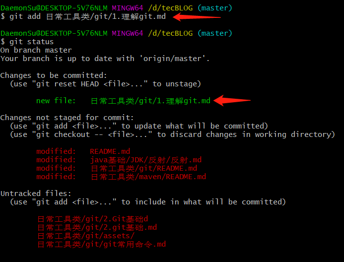

# Git基础

## 获取 Git 仓库

有两种取得 Git 项目仓库的方法。 第一种是在现有项目或目录下导入所有文件到 Git 中； 第二种是从一个服务器克隆一个现有的 Git 仓库。

### 在现有目录中初始化仓库

如果你打算使用 Git 来对现有的项目进行管理，你只需要进入该项目目录并输入：

```
$ git init
```

该命令将创建一个名为 .git 的子目录，这个子目录含有你初始化的 Git 仓库中所有的必须文件，这些文件是Git 仓库的骨干。 但是，在这个时候，我们仅仅是做了一个初始化的操作，你的项目里的文件还没有被跟踪。

​	如果你是在一个已经存在文件的文件夹（而不是空文件夹）中初始化 Git 仓库来进行版本控制的话，你应该开始跟踪这些文件并提交。 你可通过 git add 命令来实现对指定文件的跟踪，然后执行 git commit 提交：

```
$ git add *
$ git add LICENSE
$ git commit -m 'initial project version'
```

该命令将创建一个名为 .git 的子目录，这个子目录含有你初始化的 Git 仓库中所有的必须文件，这些文件是Git 仓库的骨干。 但是，在这个时候，我们仅仅是做了一个初始化的操作，你的项目里的文件还没有被跟踪。

### 克隆现有的仓库

​	如果你想获得一份已经存在了的 Git 仓库的拷贝，比如说，你想为某个开源项目贡献自己的一份力，这时就要用到 git clone 命令。 如果你对其它的 VCS 系统（比如说Subversion）很熟悉，请留心一下你所使用的命令是"clone"而不是"checkout"。 这是 Git 区别于其它版本控制系统的一个重要特性，Git 克隆的是该 Git 仓库服务器上的几乎所有数据，而不是仅仅复制完成你的工作所需要文件。 当你执行 git clone 命令的时候，默认配置下远程 Git 仓库中的每一个文件的每一个版本都将被拉取下来。

克隆仓库的命令格式是 git clone [url] 。 比如，要克隆 Git 的可链接库 libgit2，可以用下面的命令：

```
$ git clone https://github.com/libgit2/libgit
```

```
$ git clone https://github.com/libgit2/libgit2 mylibgit
```

这将执行与上一个命令相同的操作，不过在本地创建的仓库名字变为 mylibgit。

## 记录每次更新到仓库

### 跟踪文件

​		现在我们手上有了一个真实项目的 Git 仓库，并从这个仓库中取出了所有文件的工作拷贝。 接下来，对这些文件做些修改，在完成了一个阶段的目标之后，提交本次更新到仓库。工作目录下的每一个文件都不外乎这两种状态：已跟踪或未跟踪。 已跟踪的文件是指那些被纳入了版本控制的文件，在上一次快照中有它们的记录，在工作一段时间后，它们的状态可能处于未修改，已修改或已放入暂存区。 工作目录中除已跟踪文件以外的所有其它文件都属于未跟踪文件，它们既不存在于上次快照的记录中，也没有放入暂存区。 初次克隆某个仓库的时候，工作目录中的所有文件都属于已跟踪文件，并处于未修改状态。

​		编辑过某些文件之后，由于自上次提交后你对它们做了修改，Git 将它们标记为已修改文件。 我们逐步将这些修改过的文件放入暂存区，然后提交所有暂存了的修改，如此反复。所以使用 Git 时文件的生命周期如下：


执行状态查看命令  git status



其中:

出现在changes to be commited 下面，说明新增或者修改的文件已经放置到暂存区中等待提交。

出现在 Changes not staged for commit 这行下面，说明已跟踪文件的内容发生了变化，但还没有放到暂存区。

出现在untrack files下的文件是新增加的文件，没有被纳入到版本管理中。

​	 要暂存这次更新，需要运行 git add 命令。 这是个多功能命令：可以用它开始跟踪新文件，或者把已跟踪的文件放到暂存区，还能用于**合并时把有冲突的文件标记为已解决状态**等。 将这个命令理解为“添加内容到下一次提交中”而不是“将一个文件添加到项目中”要更加合适。


### 忽略文件

一般我们总会有些文件无需纳入 Git 的管理，也不希望它们总出现在未跟踪文件列表。 通常都是些自动生成的文件，比如日志文件，或者编译过程中创建的临时文件等。 在这种情况下，我们可以创建一个名为 .gitignore的文件，列出要忽略的文件模式。 

```
$ cat .gitignore
*.[oa]
*~
```

第一行告诉 Git 忽略所有以 .o 或 .a 结尾的文件。一般这类对象文件和存档文件都是编译过程中出现的。 第二
行告诉 Git 忽略所有以波浪符（~）结尾的文件，许多文本编辑软件（比如 Emacs）都用这样的文件名保存副
本。 此外，你可能还需要忽略 log，tmp 或者 pid 目录，以及自动生成的文档等等。 要养成一开始就设置好
.gitignore 文件的习惯，以免将来误提交这类无用的文件。
文件 .gitignore 的格式规范如下：
		• 所有空行或者以 ＃ 开头的行都会被 Git 忽略。
		• 可以使用标准的 glob 模式匹配。
		• 匹配模式可以以（/）开头防止递归。
		• 匹配模式可以以（/）结尾指定目录。
		• 要忽略指定模式以外的文件或目录，可以在模式前加上惊叹号（!）取反。

​	所谓的 glob 模式是指 shell 所使用的简化了的正则表达式。 星号 * 匹配零个或多个任意字符；[abc] 匹配
任何一个列在方括号中的字符（这个例子要么匹配一个 a，要么匹配一个 b，要么匹配一个 c）；问号（?
）只匹配一个任意字符；如果在方括号中使用短划线分隔两个字符，表示所有在这两个字符范围内的都可以匹配
（比如 [0-9] 表示匹配所有 0 到 9 的数字）。 使用两个星号 **  表示匹配任意中间目录，比如 a/**/z 可以匹
配 a/z , a/b/z 或 a/b/c/z 等。

### 查看已暂存和未暂存的修改


### 提交更新

将修改内容从暂存区提交到版本库可以使用以下命令：

```
$ git commit
$ git commit -m "提交内容注释"
```

当使用git  commit 命令进行提交的时候，会打开想听默认的文本编辑器，一般是vi或者是vim。可以通过

git config --global core.editor 设置打开的文本编辑器。

在默认的vi编辑器环境下你会发现编辑器里你怎么输入都没反应，这是因为vim处在不可编辑状态，按下字母键 a（此时进入编辑状态），可以开始修改注释信息了修改好后，你会发现怎么都退出不了，然后如下操作：

按下Esc (退出编辑状态)； 接着连按两次大写字母Z，你会惊喜的发现，终于保存好退出来了！

 退出编辑器时，Git 会丢掉注释行，用你输入提交附带信息生成一次提交。

### 其他

#### 跳过使用暂存区域

Git 提供了一个跳过使用暂存区域的方式， 只要在提交的时候，给 git commit 加上 -a 选项，Git 就会自动把所有已经跟踪过的文件暂存起来一并提交。

#### 移除文件

#### 移动文件

## 查看提交历史


# 附录

## 中文路径显示乱码 

执行查看状态命令

```
git status 
```


在默认设置下，中文文件名在工作区状态输出，中文名不能正确显示，而是显示为八进制的字符编码。git bash 终端输入命令：

```
git config --global core.quotepath false
```


